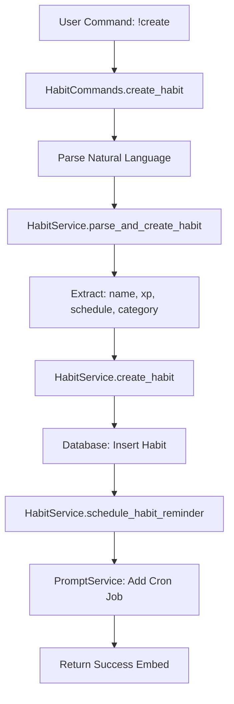
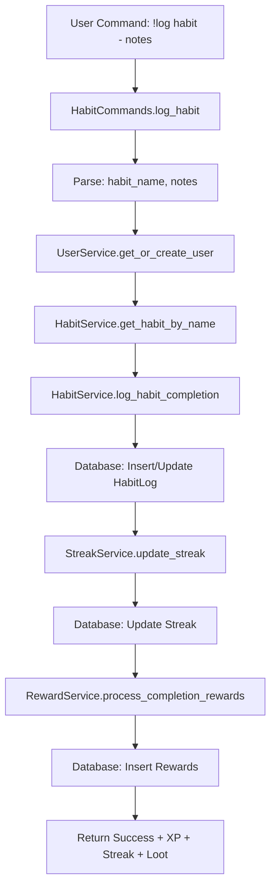
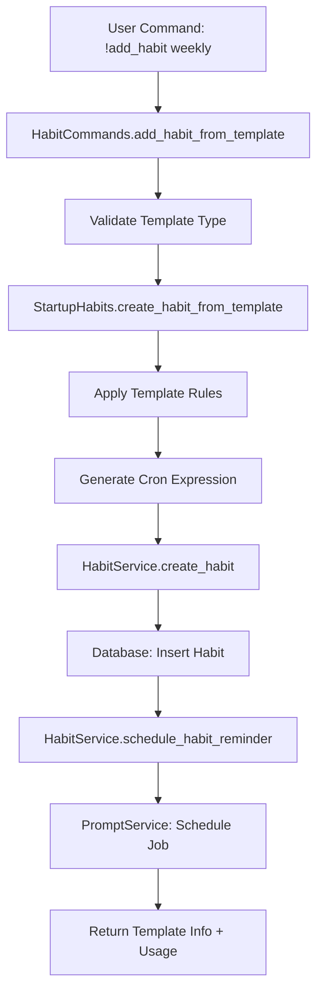
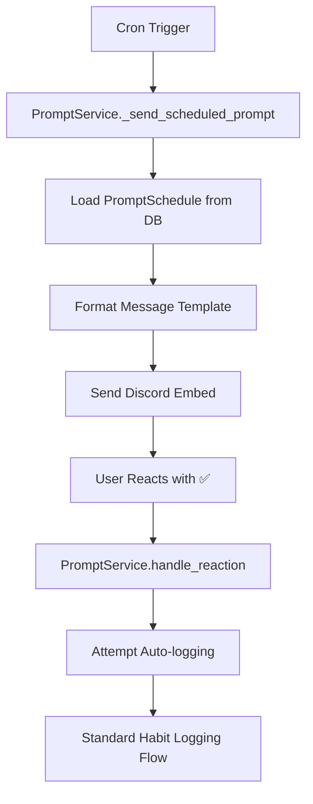
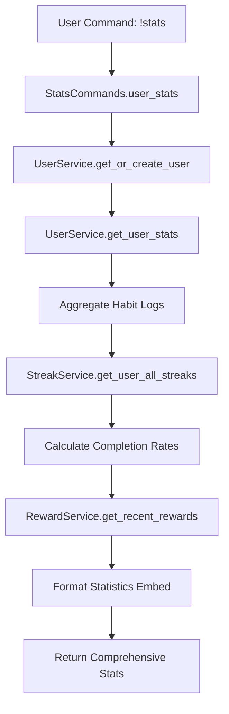

# 📊 Discord Habit Bot - Data Flow Documentation

## 🎯 Overview

This document maps how information flows through the different domains of the habit tracking system, ensuring clean communication and data consistency.

## 🔄 Primary Data Flows

### 1. **Habit Creation Flow**



**Data Transformations:**
- User input → Parsed components
- Natural language → Structured data
- Habit definition → Database record
- Schedule text → Cron expression

### 2. **Habit Logging Flow**



**Data Transformations:**
- Command text → habit_name + notes
- Notes → Extracted count (if numeric habit)
- Completion → XP reward calculation
- Streak update → Milestone bonus calculation
- Completion → RNG loot roll

### 3. **Multi-Scale Template Flow**



**Data Transformations:**
- Template type → XP scaling (15→100)
- Time scale → Cron pattern
- Template defaults → Customized parameters
- Schedule → APScheduler job

### 4. **Scheduled Reminder Flow**



**Data Transformations:**
- Cron schedule → Triggered execution
- Template YAML → Formatted Discord embed
- Emoji reaction → Habit completion attempt
- Reaction → Database log entry

### 5. **Statistics Generation Flow**



**Data Transformations:**
- User ID → Aggregated statistics
- Raw logs → Completion percentages
- Streak data → Progress indicators
- Multiple services → Unified display

## 📊 Cross-Domain Data Standards

### **Time Scale Data Mapping**
```python
TIME_SCALES = {
    "daily": {
        "xp_multiplier": 1.0,
        "cron_pattern": "0 {hour} * * *",
        "default_hour": 9
    },
    "weekly": {
        "xp_multiplier": 2.0,
        "cron_pattern": "0 {hour} * * {day}",
        "default_day": 0  # Sunday
    },
    "monthly": {
        "xp_multiplier": 3.3,
        "cron_pattern": "0 {hour} {day} * *",
        "default_day": 1  # 1st of month
    },
    "quarterly": {
        "xp_multiplier": 5.3,
        "cron_pattern": "0 {hour} {day} {months} *",
        "months": "1,4,7,10"
    },
    "yearly": {
        "xp_multiplier": 6.7,
        "cron_pattern": "0 {hour} {day} {month} *",
        "month": 1  # January
    }
}
```

### **Habit Category Mapping**
```python
CATEGORY_MAPPING = {
    "fitness": ["exercise", "workout", "gym", "run", "walk", "yoga", "stretch", "sport"],
    "wellness": ["meditation", "mindfulness", "breathe", "zen", "calm", "sleep", "hydration"],
    "learning": ["read", "book", "study", "learn", "research", "code", "skill"],
    "productivity": ["organize", "clean", "plan", "focus", "deep work", "review"],
    "creative": ["write", "draw", "music", "art", "design", "create", "imagine"]
}
```

### **XP Calculation Rules**
```python
def calculate_habit_xp(base_xp: int, time_scale: str, streak_length: int = 0) -> int:
    scale_multiplier = TIME_SCALES[time_scale]["xp_multiplier"]
    streak_bonus = min(streak_length * 0.1, 2.0)  # Max 2x bonus
    return int(base_xp * scale_multiplier * (1 + streak_bonus))
```

## 🎮 Gamification Data Flows

### **Level Progression**
```python
# XP → Level calculation
def calculate_level(total_xp: int) -> int:
    return int((total_xp / 100) ** 0.5) + 1

# Level thresholds
LEVEL_THRESHOLDS = [
    100,    # Level 2
    400,    # Level 3  
    900,    # Level 4
    1600,   # Level 5
    2500,   # Level 6
    # Continues with quadratic growth
]
```

### **Reward Roll System**
```python
def roll_loot(base_xp: int) -> List[str]:
    roll = random.randint(1, 100)
    rewards = []
    
    # Base gold reward
    gold = random.randint(base_xp, base_xp * 2)
    rewards.append(f"+{gold} gold")
    
    # Bonus rewards based on roll
    if roll >= 95:  # 5% - Legendary
        rewards.append("🌟 Legendary XP Boost (+50 XP)")
    elif roll >= 85:  # 10% - Epic  
        rewards.append("💎 Epic Focus Gem (+25 XP)")
    elif roll >= 70:  # 15% - Rare
        rewards.append("🔮 Rare Motivation Crystal (+15 XP)")
    # etc.
    
    return rewards
```

## 📱 Discord Integration Data Flows

### **Embed Standardization**
```python
def create_success_embed(title: str, description: str, data: Dict) -> discord.Embed:
    embed = discord.Embed(
        title=f"✅ {title}",
        description=description,
        color=discord.Color.green(),
        timestamp=datetime.utcnow()
    )
    
    for section, content in data.items():
        embed.add_field(name=section, value=content, inline=False)
    
    return embed
```

### **Reaction Handling**
```python
REACTION_MAPPINGS = {
    "✅": "complete",      # Standard completion
    "👍": "complete",      # Alternative completion  
    "👎": "skip",          # Skip this instance
    "⏰": "snooze",        # Remind again in 1 hour
    "❓": "help"           # Show habit details
}
```

## 🔮 External Integration Data Flows

### **Obsidian Synchronization**
```python
# Habit completion → Daily note entry
def format_habit_for_obsidian(habit_log: HabitLog) -> str:
    timestamp = habit_log.completed_at.strftime("%H:%M")
    habit_name = habit_log.habit.name
    xp = habit_log.xp_awarded
    notes = f" - {habit_log.notes}" if habit_log.notes else ""
    
    return f"- [{timestamp}] **{habit_name}** (+{xp} XP){notes}"
```

### **Future: Anki Integration**
```python
# Habit reflection → Anki card
def create_reflection_card(habit: Habit, recent_logs: List[HabitLog]) -> Dict:
    return {
        "front": f"How has your {habit.name} habit been going?",
        "back": generate_reflection_summary(recent_logs),
        "tags": [habit.category, "habit-reflection"],
        "deck": "Habits"
    }
```

## 🛡️ Data Validation Flows

### **Input Sanitization**
```python
def sanitize_habit_name(name: str) -> str:
    # Remove special characters, limit length
    sanitized = re.sub(r'[^\w\s-]', '', name)
    return sanitized[:50].strip()

def validate_cron_expression(cron: str) -> bool:
    # Validate cron format
    parts = cron.split()
    return len(parts) == 5 and all(is_valid_cron_part(part) for part in parts)
```

### **Business Rule Enforcement**
```python
def enforce_habit_rules(habit_data: Dict) -> Dict:
    # XP limits
    habit_data["base_xp"] = max(1, min(habit_data["base_xp"], 500))
    
    # Category validation
    if habit_data["category"] not in VALID_CATEGORIES:
        habit_data["category"] = "wellness"  # Default
    
    # Name uniqueness check
    # etc.
    
    return habit_data
```

## 📊 Performance Considerations

### **Database Query Optimization**
- Use database indexes on frequently queried fields
- Batch operations for multiple habit logs
- Implement query result caching for leaderboards
- Use database views for complex aggregations

### **Memory Management**
- Service instances are stateless and reusable
- Database connections use connection pooling
- Large result sets use pagination
- Cache frequently accessed configuration data

### **Async Operation Patterns**
- All database operations are async
- Service calls use proper await patterns
- Discord API calls include rate limiting
- External integrations have timeout handling

This data flow documentation ensures consistent, predictable information movement throughout the habit tracking ecosystem.